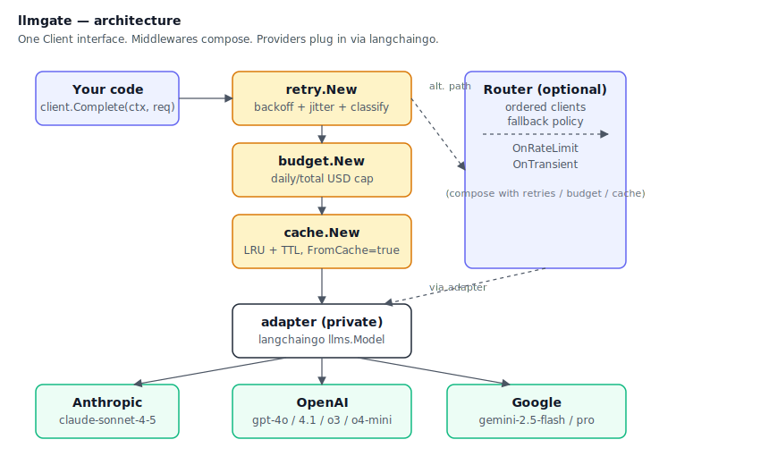
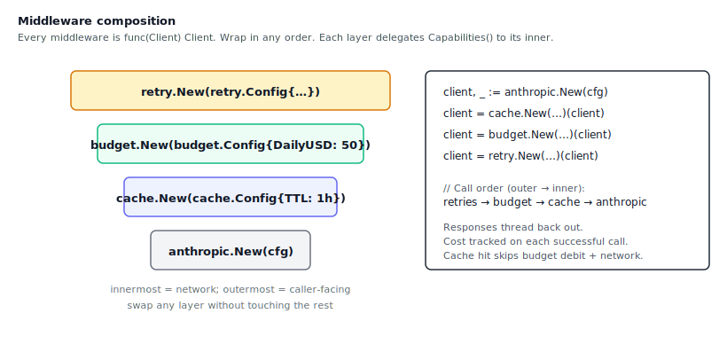
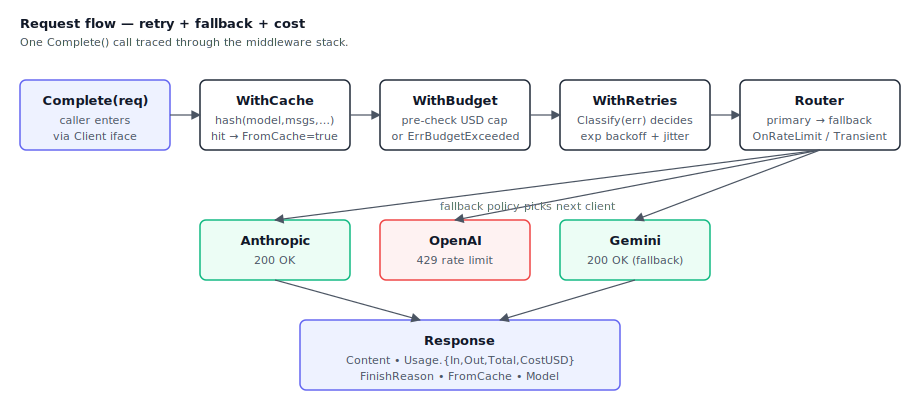

# llmgate

[](https://github.com/hallelx2/llmgate/actions/workflows/ci.yml)
[](https://pkg.go.dev/github.com/hallelx2/llmgate)
[](https://goreportcard.com/report/github.com/hallelx2/llmgate)
[](./LICENSE)

> LiteLLM for Go. A single provider-agnostic client over Anthropic,
> OpenAI, Gemini, and the rest — with a router, fallback, cost
> tracking, and capability flags on top.

`llmgate` is the LLM gateway that [vectorless-engine](https://github.com/hallelx2/vectorless-engine)
depends on, extracted into its own module so anything written in Go
can use it. It is **not** a rewrite of LiteLLM. It sits on top of
[`tmc/langchaingo`](https://github.com/tmc/langchaingo) — langchaingo
handles every provider's wire protocol, llmgate wraps that behind a
tiny `Client` interface and adds the production features langchaingo
deliberately doesn't include.

## How it fits together



The caller holds a `Client`. Middlewares (`retry.New`, `budget.New`,
`cache.New`) wrap the client; a `router.New` can sit anywhere in the chain
to fall over between providers. The private `internal/adapter` is the
single seam where llmgate's interface meets langchaingo's provider
implementations — one adapter serves all three providers.



Order matters. The outermost wrapper sees the call first; the innermost
hits the network. Put `cache.New` below `budget.New` so cache hits
don't burn budget. Put `retry.New` on top so retries run regardless
of which inner layer tripped.



A call threads through the stack, optionally falls over to a backup
provider, and comes back with `Usage.{InputTokens, OutputTokens,
TotalTokens, CostUSD}` populated — no extra call, computed from a
static price table.

## Why this exists

The Go ecosystem has two extremes:

- **Vendor SDKs** (`openai-go`, `anthropic-sdk-go`) — great typing,
  no portability. Swap providers, rewrite your call site.
- **Thin wrappers** — portable, but you lose cost, retries,
  fallbacks, and capability introspection.

`llmgate` is the middle layer. One interface. Every provider behind
it. All the production concerns — router, fallback on rate-limit,
cost per call, capability flags — baked in rather than bolted on.

## Status

Early code. Interface is the stable surface; implementations evolve
underneath. Roadmap tracked in
[vectorless-engine/docs/roadmaps/LLMGATE.md](https://github.com/hallelx2/vectorless-engine/blob/main/docs/roadmaps/LLMGATE.md).

**What's in now:**

- `Client` interface with `Complete` + `CountTokens`
- Anthropic, OpenAI, Gemini — all backed by `langchaingo/llms`, in the `provider/` subpackages
- A single internal adapter; add a provider = add a ~30-line file
- `retry.New` middleware for exp-backoff on transient errors
- Cost tracking via a static `pricing` table + `Usage.CostUSD` on every Response
- Capability flags (`MaxContext`, `SupportsJSONMode`, `SupportsStreaming`, `SupportsTools`, `SupportsVision`) with a `capabilities.Capable` interface
- `router.New` with per-provider fallback (`router.OnRateLimit`, `router.OnTransient`, or a custom `router.FallbackPolicy`)
- `budget.New` middleware with daily + total USD caps and UTC rollover
- `cache.New` middleware — in-memory LRU keyed on request shape, optional TTL
- Error classification (`Classify`, `IsRateLimited`, `IsTransient`, `IsAuth`) that the retry predicate and router policies use to decide what to retry or fall over on
- `Mock` client with call recording for tests

**Coming next:**

- Concrete streaming + tool-use implementations across providers (interfaces and types are already declared)
- Native `count_tokens` via each provider's counting endpoint

## Install

```bash
go get github.com/hallelx2/llmgate
```

## Use

```go
package main

import (
    "context"
    "fmt"
    "os"

    "github.com/hallelx2/llmgate"
    "github.com/hallelx2/llmgate/middleware/retry"
    "github.com/hallelx2/llmgate/provider/anthropic"
)

func main() {
    client, err := anthropic.New(anthropic.Config{
        APIKey: os.Getenv("ANTHROPIC_API_KEY"),
        Model:  "claude-sonnet-4-5",
    })
    if err != nil {
        panic(err)
    }

    // Optional: wrap in exponential-backoff retry middleware.
    client = retry.New(retry.Config{MaxRetries: 3})(client)

    resp, err := client.Complete(context.Background(), llmgate.Request{
        Messages: []llmgate.Message{
            {Role: llmgate.RoleUser, Content: "In one sentence: what is vectorless retrieval?"},
        },
        MaxTokens: 256,
    })
    if err != nil {
        panic(err)
    }

    fmt.Println(resp.Content)
}
```

## Design principles

- **The interface is tiny.** `Complete`, `CountTokens`, later
  `Stream`, later `Capabilities`. If it doesn't fit, it goes in a
  middleware, not the interface.
- **Middleware over inheritance.** Retries, caching, cost tracking,
  rate-limiting — all `func(Client) Client` wrappers. Compose them.
- **No magic config.** No viper, no auto-reload, no remote backends.
  Pass a struct, get a client.
- **Provider-specific features are honoured where they matter.**
  Anthropic prompt caching, OpenAI structured outputs, Gemini long
  context — opt in via config, not via a lowest-common-denominator
  API.
- **Pure IO-bound code.** Parallelism is always network-bound.
  `errgroup` + `semaphore`, no worker pools.

See [DESIGN.md](./DESIGN.md) for the longer-form write-up and
[ROADMAP.md](./ROADMAP.md) for phases.

## License

Apache 2.0. See [LICENSE](./LICENSE).
